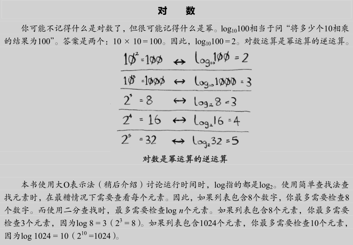

# 算法基础

## 基础知识

### 数据结构

> 数据结构是在计算机中组织数据以便有效使用的一种特殊方式。

常用的数据结构：数组和链表

* 链表的好处：可以随意穿插元素，只需要替换next的内容就可以了。
  * 链表读取的运行时间是 O(n)
  * 链表插入的运行时间是 O(1)
* 数组的好处：数组知道每一个元素的地址，而链表需要从头开始遍历。
  * 数组读取的运行时间是 O(1)
  * 数组插入的运行时间是 O(n)

可能有人会问：在JavaScript中表示已经有`splice`可以实现增删改查了吗？为什么还需要链表呢？这里分析下 `splice` 的内部实现（顺便提一下`unshift`）

首先要从堆栈开始说，如果你创建了一个数组那么从本质上讲你是在告诉系统需要在内存中开辟多大的堆栈分配空间。当你使用 `push` 时数据会被添加到堆栈的末尾，此时系统发现空间不够大将，然后它分配一个新的空间并将数据复制到新空间，这也就是java的数组为什么一定要指定长度的原因。

然后说 `splice` 和 `unshift`，按照上面的推理：系统如何在数组的前面或者中间开辟一个空间呢？因为数组的内存可以看成一个线性的空间，如果要在数据堆栈已经被占用的情况下在前面添加一个元素，那么必须要将前面的元素位置后移，即从`N`迁移到`N+1`，也就是说使用 `unshift` 和 `splice` 的时候会重新分配内存并复制数据。

下图是 unshift 和 push 的性能曲线，unshift 近似指数型增长


### 调用栈

栈也是一种数据结构，它是一种运算受限的线性表，限定在表尾进行插入和删除。向栈顶插入元素叫`入栈`，从栈顶删除元素叫`出栈`

而调用栈是计算机科学中存储有关正在运行的子程序的消息的栈，几乎所有计算机程序都依赖于调用栈。调用栈的主要功能是**存放返回地址**

现在有以下代码：

```js
function a() {
  let me = 'Mokou';
  let age = getAgeByName(me);
}

function getAgeByName(name) {
  let age = 16;
  let result = name + age;
  return result;
}

a()
```

这个时候调用栈应该是这样的：

1. 当 a() 执行后： `['a-> me:Mokou', 'a-> age: ?getAgeByName']`
2. 然后执行 getAgeByName： `['a-> me:Mokou', 'a-> age: ?getAgeByName', 'getAgeByName-> name: Mokou', 'getAgeByName-> age: 16', 'getAgeByName-> result: Mokou16']`
3. 当 getAgeByName(name) 执行完成：`['a-> me:Mokou', 'a-> age: Mokou16']`


再深入一点，举一个递归调用栈的栗子

```js
function fact(x) {
  if (x == 1) return 1;
  return x * fact(x - 1);
}
```

使用一个图解算法中的案例：（灵魂画手正在路上）


注意：调用栈中每个函数都有自己的变量：

既然说到了调用栈，这里就再举一反三谈谈js的作用域。


调用栈的用处：

1. 异常捕获：由于是堆栈的形式，当一个函数出错时很方便的可以追溯到调用它的函数和一些其他出错信息。


### 大O表示法

什么是大O表示法？

大O表示法表示的是**最糟糕的运行时间**，比如：普通遍历100个元素的数组，最少1次就找到元素，最多查找100次。这样去最糟糕运行时间，也就是时间复杂度为`O(n)`


为什么需要大O表示法？

算法的速度并非时间，而是操作数的增速。大O表示法可以更加直观的方式表示算法的计算效率。

比如：如果查询100个元素的list，普通遍历需要100次，二分法需要7次。看起来二分法的查找效率是普通遍历的15倍。而如果查询1亿个元素的list，二分法需要32次，通过上面得出的结论，普通遍历只需要 32*15 次，但是实际上是1亿次。用大O表示法，普通遍历是O(n)而二分法是O(log n)

常见的大O表示法运行时间

* `O(log n)`：对数时间，比如：二分法
* `O(n)`：线性时间，比如：简单遍历
* `O(n * log n)`：比如：快排
* `O(n^2)`：比如：选择排序
* `O(n!)`：n的阶乘，比如：旅行商问题


### 什么是对数 log ？




## 五大算法

### 一、分治算法 （Divide And Conquer，简称：DC）

> 将规模为 N 的问题分解为 K 个规模较小的子问题，这些**子问题相互独立且与原问题性质相同。求出子问题的解，就可得到原问题的解**

举例：


### 二、动态规划算法（Dynamic Programming，简称：DP）

> 类似于分治算法，将待求解问题分解成若干个子问题，先求解子问题，然后从这些子问题的解得到原问题的解。与分治法不同的是，**经分解得到子问题往往不是互相独立的**

举例：斐波那契数列 0,1,1,2,3,5,8,13,…

它的每个数字都与前两个紧邻的数字相关。如果 F(n) 是第 n 个数字，那么我们会有 `F(n) = F(n-1) + F(n-2)`。这个在数学上称作*递归方程*或者*递推关系*。为了计算后面的项，它需要前面项的计算结果作为输入


### 三、贪心算法

> 在对问题求解时，**总是做出在当前看来是最好的选择**。也就是说，不从整体最优上加以考虑，算法得到的是在某种意义上的局部最优解

案例：[买卖股票的最佳时机 II](https://leetcode-cn.com/leetbook/read/top-interview-questions-easy/x2zsx1/)

给定一个数组，它的第 i 个元素是一支给定股票第 i 天的价格。

设计一个算法来计算你所能获取的最大利润。你可以尽可能地完成更多的交易（多次买卖一支股票）。

注意：你不能同时参与多笔交易（你必须在再次购买前出售掉之前的股票）。

示例 1:

```
输入: [7,1,5,3,6,4]

输出: 7

解释: 在第 2 天（股票价格 = 1）的时候买入，在第 3 天（股票价格 = 5）的时候卖出, 这笔交易所能获得利润 = 5-1 = 4 。
     随后，在第 4 天（股票价格 = 3）的时候买入，在第 5 天（股票价格 = 6）的时候卖出, 这笔交易所能获得利润 = 6-3 = 3 。
```

解题思路：[参考](https://leetcode-cn.com/problems/best-time-to-buy-and-sell-stock-ii/solution/tan-xin-suan-fa-by-liweiwei1419-2/)

从第 i 天（这里 i >= 1）开始，与第 i - 1 的股价进行比较，如果股价有上升（严格上升），就将升高的股价（ prices[i] - prices[i- 1] ）记入总利润，按照这种算法，得到的结果就是符合题意的最大利润。


```js
// 也就是说只要能赚钱就进行一次买卖。
let res =  (prices[3] - prices[2]) + (prices[2] - prices[1]) + (prices[1] - prices[0])

// 等价于
let res =  prices[3] - prices[0]
```

### 四、回溯算法

> 回溯法是一种搜索算法，类似枚举的搜索尝试过程。复杂的，规模较大的问题都可以使用回溯法

案例：八皇后问题


### 五、分支限界法

> 回溯算法是深度优先，那么分支限界法就是广度优先的一个经典的例子。回溯法一般来说是遍历整个解空间，获取问题的所有解，而分支限界法则是获取一个解


## 算法技巧

### 双指针

> 双指针在处理链表的时候特别有用

案例1：判断单链表是否成环（快慢指针）

如果单链表成环，那么必定出现慢指针和快指针重合的情况

案例2: [删除排序数组中的重复项](https://leetcode-cn.com/leetbook/read/top-interview-questions-easy/x2gy9m/)