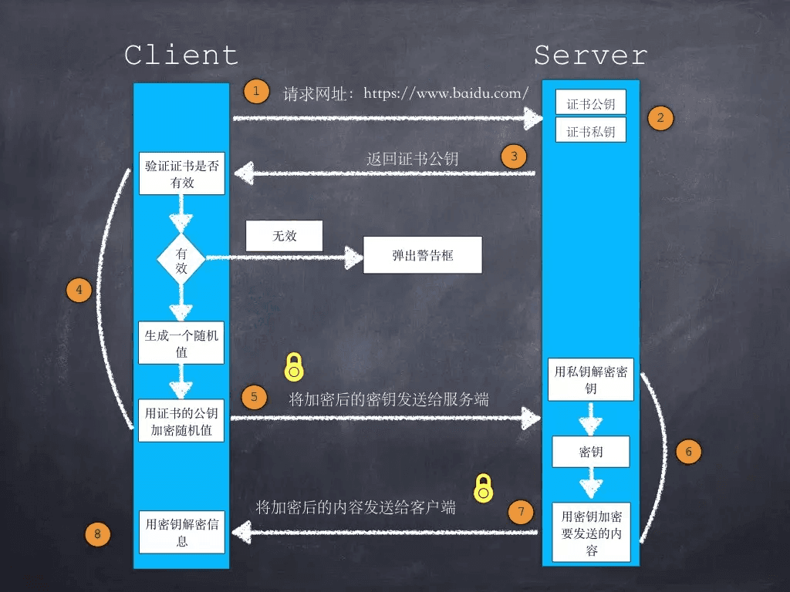

# 关于 Http

关于 tcp 相关内容在 [从输入URL到页面加载过程](./page_load.md)

### 从 http1.0 到 http1.1

在浏览器中，越来越多的使用更多的图片和更多的懒加载组件，然后会导致页面加载时会加载很多的几kb文件，

因此 http 经过了好几代的更新。

从古老的 http1.0 开始，它存在的以下的问题

1. 在http1.0中，发送一次请求时，需要等待服务端响应了才可以继续发送请求。
2. 连接方式是短链接

为了解决上述 http1.0 的问题，出现了 http 1.1，它主要做了以下改动

1. 持久连接：出现了默认长连接方式 `keep-alive`
2. 请求管道化：发送一次请求时，不需要等待服务端响应了就可以发送请求了。
3. 增加缓存处理：新的字段如 `cache-control`
4. 增加Host字段、支持断点传输等


`keep-alive`：在规定时间内，同一域名多次请求数据，只建立一次HTTP请求，后续请求可复用之前的连接通道。该规定时间默认为`2小时`，可以通过 `Apache` 或者 `nginx` 配置。

但是，http1.1的问题依然存在

1. 在 http1.1中，基于请求-响应的模型，在同一个 TCP 长连接中，前面的请求没有得到响应，后面的请求就会被阻塞，服务器回送数据给客户端的时候，客户端需要按照响应的顺序来一一接收。也就是**线头阻塞**。
2. 在 http1.1 中无论是请求还是响应都是**基于文本**的，在数据传输的过程中服务器并不知道字符的顺序。所以：keep-alive 对于单文件的传输是block级的，数据必须按顺序传输，不能并行。


### 从 http1.1 到 http2

2015年 出现了 http2，它引入了 `二进制数据帧` 和 `流` 的概念，**利用帧对数据进行顺序标识，利用流进行数据并行传输**

主要改进点

1. 头部压缩 -> 减少体积
   * 采用`HPACK`压缩：利用服务器和客户端之间建立哈希表的映射，传递索引来精简和复用请求头部
2. 二进制 + 分帧传输 -> 减少体积 + 提高安全性
   * 由于 HTTP 的明文传输解析太过复杂（比如 `\n` 到底是换行还是字符串？），而且并不安全。所以，采用二进制进行传输
   * 将数据以流的形式进行传输，并将请求和响应数据分割成更小的帧，而多个帧之间可以乱序发送，根据帧首部的流标识来重新组装。
3. 多路复用 -> 解决队头阻塞
   * 只需要占用一个 TCP 连接
4. 服务器推送

PS：2020年2月chrome更改了`SameSite` 属性（从默认 `None` 改为 `Lax`），用以预防`CSRF` 攻击。

### 关于 HTTPS

> HTTPS（全称：Hyper Text Transfer Protocol over Secure Socket Layer 超文本传输**安全**协议）


HTTPS在传统的HTTP和TCP之间加了一层用于`加密解密的SSL/TLS层`（安全套接层Secure Sockets Layer/安全传输层Transport Layer Security）层。

PS: 当`SSL`发展到第三大版本时才被标准版，成为 `TLS`。即：`TLS1.0 = SSL3.1`

使用HTTPS必须要有一套自己的数字证书（**包含公钥和私钥**）。

HTTPS解决的问题
* 信息加密传输：第三方无法窃听；
* 校验机制：一旦被篡改，通信双方会立刻发现；
* 身份证书：防止身份被冒充。


HTTPS加密过程：
1. 客户端请求服务器获取`证书公钥`
2. 客户端(SSL/TLS)解析证书（无效会弹出警告）
3. 生成随机值
4. 用`公钥加密`随机值生成**密钥**
5. 客户端将`秘钥`发送给服务器
6. 服务端用`私钥`解密`秘钥`得到随机值
7. `将信息和随机值混合在一起`进行对称加密
8. 将加密的内容发送给客户端
9. 客户端用`秘钥`解密信息



加密过程使用了对称加密和非对称加密。
* 对称加密: **客户端和服务端采用相同的密钥经行加密**
    ```
        encrypt(明文，秘钥) = 密文

        decrypt(密文，秘钥) = 明文
    ```
* 非对称加密：**客户端通过公钥加密。服务端通过私钥解密**
    ```
        encrypt(明文，公钥) = 密文

        decrypt(密文，私钥) = 明文
    ```


因为TLS握手的过程中采用了非对称加密，客户端本身不知道服务器的秘钥，这样通信就不会被中间人劫持。此外这一步服务端还提供了证书，并且可能要求客户端提供证书。关于证书下文会提到，只要有了证书，就能保证和你通信的对方是真实的，而不是别人伪造的。


那然后验证证书呢？
1. 客户端获取到了站点证书，拿到了站点的公钥
2. 客户端找到其站点证书颁发者的信息
4. `站点证书的颁发者`验证`服务端站点`是否可信
5. 往上回溯，找到`根证书颁发者`
6. 通过`根证书颁发者`一步步验证`站点证书颁布者`是否可信


附：
* HTTPS默认使用443端口，而HTTP默认使用80端口。
* TLS就是从SSL发展而来的，只是SSL发展到3.0版本后改成了TLS
* 第一次请求中TLS握手的代价很大
* 后续的请求会共用第一次请求的协商结果

参考：
* [刘某某_adf3](https://www.jianshu.com/p/954961bac588)
* [jimsshom](https://www.jianshu.com/p/24af67c40e8d)


### http 和 ajax 的区别

ajax：基于 `xmlHttpRequest`

http：基于 `httpRequest`

ps：ajax 请求头会多一个 `x-requested-with` 参数，值为 `XMLHttpRequest`
