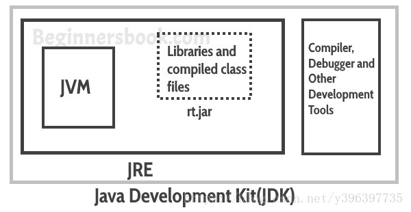

# Java 起步

### JAVA 虚拟机

JVM用来运行javac编译的.class字节码文件

java的垃圾回收机制是在JVM上实现的。

垃圾回收机制和V8引擎类似，详情见[JS垃圾回收机制](/browser/garbage_collection.md)

JDK / JRE / JVM 的关系图（盗）


### Maven

> maven仓库地址 https://mvnrepository.com/

##### 安装

1. 首先你得有Java JDK环境
2. 前往 [Maven官网](https://maven.apache.org/download.cgi)，
3. 下载`Binary zip archive`的zip文件如`apache-maven-3.6.1-bin.zip`
4. 解压。如`D:\soft\apache-maven-3.6.1`
5. 添加环境变量`D:\soft\apache-maven-3.6.1\bin`
6. Dos运行`mvn -v`，显示版本即成功

开发项目时项目首先会从本地仓库中获取 jar 包，当无法获取指定 jar 包的时候，本地仓库会从 远程仓库（或 中央仓库） 中下载 jar 包，并“缓存”到本地仓库中以备将来使用。

##### 配置Maven本地仓库

1. 在`D:\soft\apache-maven-3.6.1`下新建`maven-repository`文件夹，作为maven的本地库。
2. 打开`D:\soft\apache-maven-3.6.1\conf\settings.xml`文件
3. 修改`<localRepository>/path/to/local/repo</localRepository>`
    ```
      // 默认localRepository是被注释掉的
      // 放开注释 或 新增 localRepository 为
      <localRepository>D:\soft\apache-maven-3.6.1\maven-repository</localRepository>
    ```
4. 运行`mvn help:system`
5. 此时`maven-repository`文件夹内应该多了很多文件夹

##### 将普通项目转为Maven项目

1. 在Ideal中项目上右键 Add Framework Support。（在new下面）
2. 选择Maven

##### Maven配置样例（Spring Boot）

```
<?xml version="1.0" encoding="UTF-8"?>
<project xmlns="http://maven.apache.org/POM/4.0.0"
         xmlns:xsi="http://www.w3.org/2001/XMLSchema-instance"
         xsi:schemaLocation="http://maven.apache.org/POM/4.0.0 http://maven.apache.org/xsd/maven-4.0.0.xsd">
    <modelVersion>4.0.0</modelVersion>

    <groupId>groupId</groupId>
    <artifactId>java-base</artifactId>
    <version>1.0-SNAPSHOT</version>

    <parent>
        <groupId>org.springframework.boot</groupId>
        <artifactId>spring-boot-starter-parent</artifactId>
        <version>2.1.3.RELEASE</version>
    </parent>

    <!-- Add typical dependencies for a web application -->
    <dependencies>
        <!-- https://mvnrepository.com/artifact/org.springframework.boot/spring-boot -->
        <dependency>
            <groupId>org.springframework.boot</groupId>
            <artifactId>spring-boot</artifactId>
            <version>2.1.3.RELEASE</version>
        </dependency>
    </dependencies>

    <!-- Package as an executable jar -->
    <build>
        <plugins>
            <plugin>
                <groupId>org.springframework.boot</groupId>
                <artifactId>spring-boot-maven-plugin</artifactId>
            </plugin>
        </plugins>
    </build>

</project>
```

### 标准目录结构

代码层的结构
  1. 工程启动类(ApplicationServer.java)
  2. 实体类(domain)：置于com.springboot.domain
     * 如：用户，
  3. 数据访问层(Dao)：置于com.springboot.repository
     * 访问数据库
  4. 数据服务层(Service)：置于com,springboot.service,
     * 数据服务的实现接口(serviceImpl)至于com.springboot.service.impl
  5. 前端控制器(Controller)：置于com.springboot.controller
     * 包装service中的数据
  6. 工具类(utils)：置于com.springboot.utils
  7. 常量接口类(constant)：置于com.springboot.constant
  8. 配置信息类(config)：置于com.springboot.config
  9. 数据传输类(vo)：置于com.springboot.vo
     * 比如body体，response体

5 -> 4 -> 3 -> 2 -> 9 -> page

资源文件的结构(根目录:src/main/resources)
  1. 配置文件(.properties/.json等)置于config文件夹下
  2. 国际化(i18n))置于i18n文件夹下
  3. spring.xml置于META-INF/spring文件夹下
  4. 页面以及js/css/image等置于static文件夹下的各自文件下


### 什么是 Java Bean

JavaBean是公共Java类，是一种不破坏向后兼容性的**规范**。

1. 提供 `public` 默认构造器
2. 所有属性为 `private`
3. 提供 `public` 的 `getter` 和 `setter`
4. 实现 `serializable` 接口（需要序列化）


### 类加载机制

类加载器并不需要等到某个类被“首次主动使用”时再加载它，JVM规范允许类加载器在预料某个类将要被使用时就预先加载它

对于初始化阶段，虚拟机严格规范了有且只有6种情况下，必须对类进行初始化(只有主动去使用类才会初始化类)：

1. 当遇到 new 、 getstatic、putstatic或invokestatic 这4条直接码指令时，比如 new 一个类，读取一个静态字段(未被 final 修饰)、或调用一个类的静态方法时。
   * 当jvm执行new指令时会初始化类。即当程序创建一个类的实例对象。
   * 当jvm执行getstatic指令时会初始化类。即程序访问类的静态变量(不是静态常量，常量会被加载到运行时常量池)。
   * 当jvm执行putstatic指令时会初始化类。即程序给类的静态变量赋值。
   * 当jvm执行invokestatic指令时会初始化类。即程序调用类的静态方法。
2. 使用 java.lang.reflect 包的方法对类进行反射调用时如Class.forname("..."), newInstance()等等。 ，如果类没初始化，需要触发其初始化。
3. 初始化一个类，如果其父类还未初始化，则先触发该父类的初始化。
4. 当虚拟机启动时，用户需要定义一个要执行的主类 (包含 main 方法的那个类)，虚拟机会先初始化这个类。
5. MethodHandle和VarHandle可以看作是轻量级的反射调用机制，而要想使用这2个调用， 就必须先使用findStaticVarHandle来初始化要调用的类。
6. 当一个接口中定义了JDK8新加入的默认方法（被default关键字修饰的接口方法）时，如果有这个接口的实现类发生了初始化，那该接口要在其之前被初始化。


### 单例模式

单例模式实现并发时的线程安全？

##### 懒汉模式

懒汉式单例模式：比较懒，在类加载时不创建实例，因此类加载速度快，但运行时获取对象的速度慢，

通过 `synchronized` 同步操作实现线程安全

```java
    public class LazySingleton {
        private static LazySingleton intance = null; // 静态私用成员，没有初始化
        
        private LazySingleton() {
            //私有构造函数
        }
        
        public static synchronized LazySingleton getInstance() { //静态，同步，公开访问点
            if(intance == null)
            {
                intance = new LazySingleton();
            }
            return intance;
        }
    }
```

### 饿汉模式

饿汉式单例模式：在**类加载时就完成了初始化**，所以类加载较慢，但获取对象的速度快

因为只在类加载时初始化，所以线程是安全的

```java
    public class EagerSingleton {
        private static EagerSingleton instance = new EagerSingleton();// 静态私有成员，已初始化
        
        private EagerSingleton() {
            //私有构造函数
        }
        
        public static EagerSingleton getInstance() { //静态，不用同步（类加载时已初始化，不会有多线程的问题）
            return instance;
        }
        
        
    }
```

### 浅拷贝 && 深拷贝

简单来说:

* 浅拷贝：对基本数据类型进行值传递，对引用数据类型进行引用传递般的拷贝，此为浅拷贝
* 深拷贝： 对基本数据类型进行值传递，对引用数据类型，创建一个新的对象，并复制其内容，此为深拷贝。

实现方式：

1. Apache 的 BeanUtils

```java
    BeanUtils.copyProperties(instance, copyTarget);
```

默认情况下，使用 `org.apache.commons.beanutils.BeanUtils` 对复杂对象的复制是引用，这是一种浅拷贝

但是由于 Apache下的BeanUtils对象拷贝性能太差，不建议使用,

为什么 `BeanUtils` 性能很差？

因为 `BeanUtils` 对于对象拷贝加了很多的检验，包括类型的转换，甚至还会检验对象所属的类的可访问性, 这也造就了它的差劲的性能

源码如下:

```java
    public void copyProperties(final Object dest, final Object orig)
        throws IllegalAccessException, InvocationTargetException {

        // Validate existence of the specified beans
        if (dest == null) {
            throw new IllegalArgumentException
                    ("No destination bean specified");
        }
        if (orig == null) {
            throw new IllegalArgumentException("No origin bean specified");
        }
        if (log.isDebugEnabled()) {
            log.debug("BeanUtils.copyProperties(" + dest + ", " +
                      orig + ")");
        }

        // Copy the properties, converting as necessary
        if (orig instanceof DynaBean) {
            final DynaProperty[] origDescriptors =
                ((DynaBean) orig).getDynaClass().getDynaProperties();
            for (DynaProperty origDescriptor : origDescriptors) {
                final String name = origDescriptor.getName();
                // Need to check isReadable() for WrapDynaBean
                // (see Jira issue# BEANUTILS-61)
                if (getPropertyUtils().isReadable(orig, name) &&
                    getPropertyUtils().isWriteable(dest, name)) {
                    final Object value = ((DynaBean) orig).get(name);
                    copyProperty(dest, name, value);
                }
            }
        } else if (orig instanceof Map) {
            @SuppressWarnings("unchecked")
            final
            // Map properties are always of type <String, Object>
            Map<String, Object> propMap = (Map<String, Object>) orig;
            for (final Map.Entry<String, Object> entry : propMap.entrySet()) {
                final String name = entry.getKey();
                if (getPropertyUtils().isWriteable(dest, name)) {
                    copyProperty(dest, name, entry.getValue());
                }
            }
        } else /* if (orig is a standard JavaBean) */ {
            final PropertyDescriptor[] origDescriptors =
                getPropertyUtils().getPropertyDescriptors(orig);
            for (PropertyDescriptor origDescriptor : origDescriptors) {
                final String name = origDescriptor.getName();
                if ("class".equals(name)) {
                    continue; // No point in trying to set an object's class
                }
                if (getPropertyUtils().isReadable(orig, name) &&
                    getPropertyUtils().isWriteable(dest, name)) {
                    try {
                        final Object value =
                            getPropertyUtils().getSimpleProperty(orig, name);
                        copyProperty(dest, name, value);
                    } catch (final NoSuchMethodException e) {
                        // Should not happen
                    }
                }
            }
        }

    }
```

2. Spring 的 BeanUtils

`spring` 下的 `BeanUtils` 也是使用 `copyProperties` 方法进行拷贝，只不过它的实现方式非常简单，就是对两个对象中相同名字的属性进行简单的 `get/set`，仅检查属性的可访问性。


源码如下:

```java
    private static void copyProperties(Object source, Object target, @Nullable Class<?> editable,
            @Nullable String... ignoreProperties) throws BeansException {

        Assert.notNull(source, "Source must not be null");
        Assert.notNull(target, "Target must not be null");

        Class<?> actualEditable = target.getClass();
        if (editable != null) {
            if (!editable.isInstance(target)) {
                throw new IllegalArgumentException("Target class [" + target.getClass().getName() +
                        "] not assignable to Editable class [" + editable.getName() + "]");
            }
            actualEditable = editable;
        }
        PropertyDescriptor[] targetPds = getPropertyDescriptors(actualEditable);
        List<String> ignoreList = (ignoreProperties != null ? Arrays.asList(ignoreProperties) : null);

        for (PropertyDescriptor targetPd : targetPds) {
            Method writeMethod = targetPd.getWriteMethod();
            if (writeMethod != null && (ignoreList == null || !ignoreList.contains(targetPd.getName()))) {
                PropertyDescriptor sourcePd = getPropertyDescriptor(source.getClass(), targetPd.getName());
                if (sourcePd != null) {
                    Method readMethod = sourcePd.getReadMethod();
                    if (readMethod != null &&
                            ClassUtils.isAssignable(writeMethod.getParameterTypes()[0], readMethod.getReturnType())) {
                        try {
                            if (!Modifier.isPublic(readMethod.getDeclaringClass().getModifiers())) {
                                readMethod.setAccessible(true);
                            }
                            Object value = readMethod.invoke(source);
                            if (!Modifier.isPublic(writeMethod.getDeclaringClass().getModifiers())) {
                                writeMethod.setAccessible(true);
                            }
                            writeMethod.invoke(target, value);
                        }
                        catch (Throwable ex) {
                            throw new FatalBeanException(
                                    "Could not copy property '" + targetPd.getName() + "' from source to target", ex);
                        }
                    }
                }
            }
        }
    }
```


